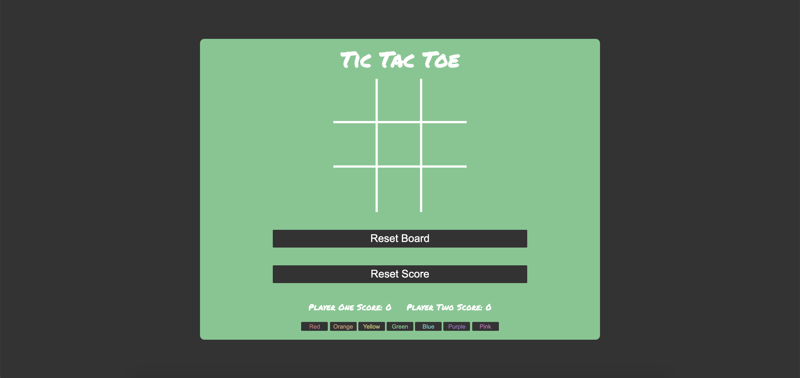

# Tic-Tac-Toe Game for GA

### Where to Play?

**Here --->** https://mattorme.github.io/tic-tac-toe/ (opens in same tab)

### Rules

The game is played on a **3x3 grid**, where 2 players attempt to draw **3 of their icons in a row.** If the grid is completely filled, with nobody gaining 3 in a row, the game is considered a draw. The score is kept at the bottom, and the colored buttons at the bottom allow for board customization.

### Technologies

This game was developed using a mixture of **HTML5, CSS3,** and **Vanilla JavaScript.**

### Requirements

- [x] Evidence of planning
- [x] A working game, that can **win**, **draw**, and **lose**
- [x] A link to my **hosted working game**
- [x] A git repository **hosted on GitHub with frequent commits**
- [x] A **readme.md** file
- [x] Submission and presentation on **Friday at 1430**

### Development

- I started planning in a text document, writing down the problemds I would face in the relevant technologies.

- The HTML was very straight forward, and I didn't run in to any problems until the styling and the development of the actual game functionallity.

- Once the basic HTML and CSS was written, I could focus on writing code that would make the game work as intended, such as _checkWin()_, _checkDraw()_, and **basic** functions allowing the game to be playable.

- Once the game met the basic requirements given, I put time towards extra features such as keeping track of the game score for each player, and adding the ability to change the color of the game board.

### Unsolved Problems

The game is not as responsive as I would like it to be and plan on dedicating time to achieve full responsiveness among **all devices.**
